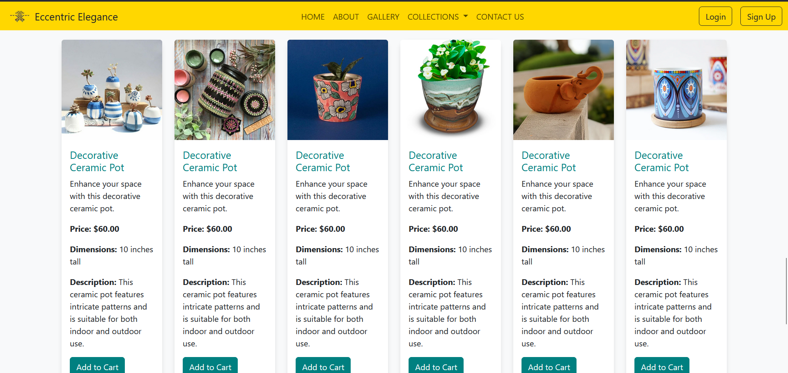

# Eccentric Elegance 🌸✨

A responsive static website for **Eccentric Elegance**, showcasing curated products like mugs, pots, jewelry, and home décor items.  
Built using **HTML** and **CSS**

---

## 📷 Project Screenshot

---

## 🚀 Features

- Responsive multi-page website.
- Pages included:
   - Home Page (`index.html`)
   - Gallery Page
   - Mugs Page
   - Pots Page
   - Jewelry Page
   - Home Décor Page
   - Login Page
   - Sign-Up Page
   - Contact Page
- Simple and elegant UI design.

---

## 📁 Project Structure

eccentric-elegance-website/
│
├── index.html
├── gallery.html
├── mugs.html
├── pots.html
├── jewelry.html
├── home-decor.html
├── login.html
├── signup.html
├── contact.html
├── css/
│ └── style.css
├── images/
│ └── your_product_images.png
├── README.md
└── screenshots/
└── website_demo.png

---

## 📦 How to Run

1. Clone or download this repository.
2. Open `index.html` in any web browser.
3. Navigate between pages using the website’s navbar or links.

---

## 📎 Developed By

**[Aasmi Jugari](https://github.com/AasmiJugari)**
